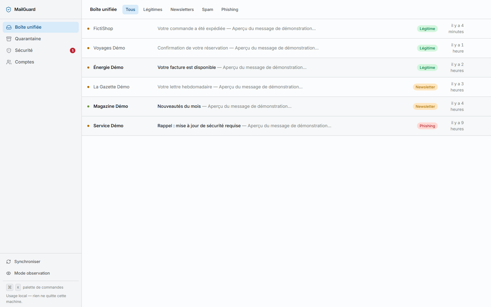
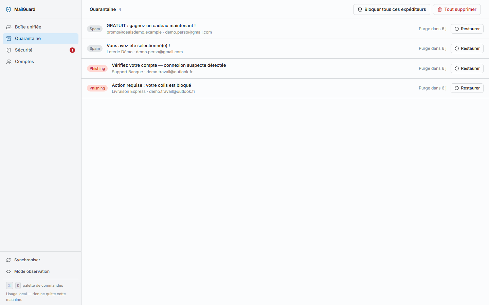
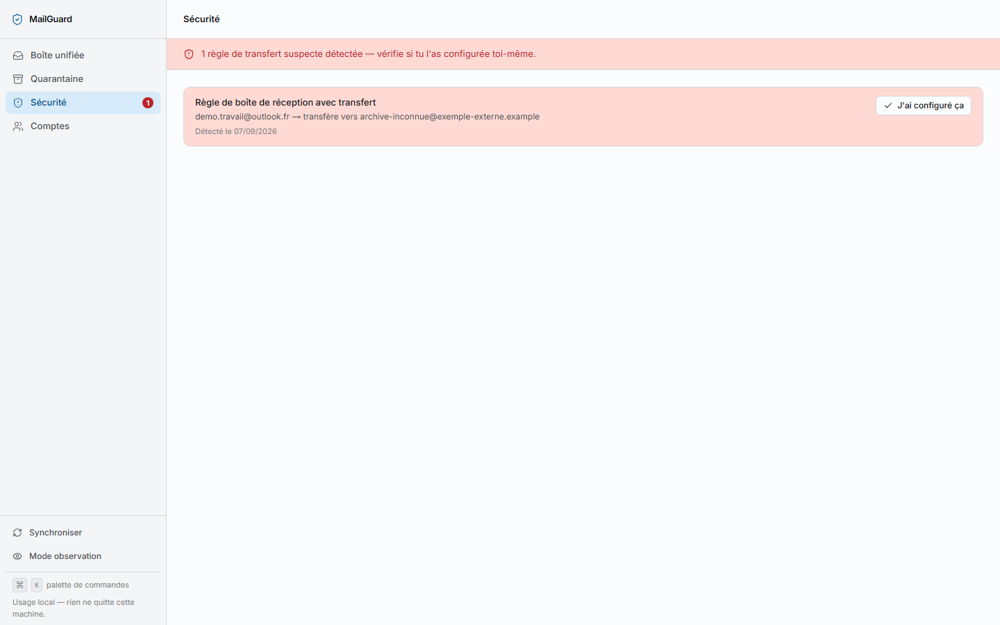
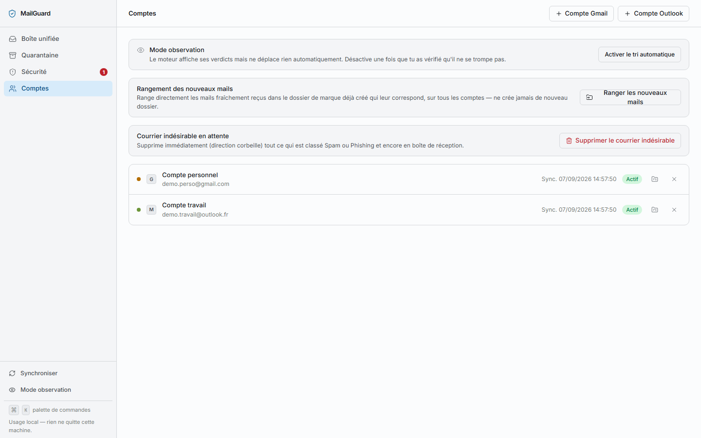
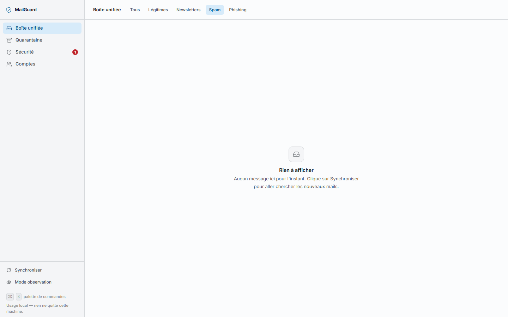

# MailGuard

A local, privacy-first mail-triage dashboard for Gmail and Outlook/Microsoft 365. Classify spam and phishing, quarantine suspicious mail, audit security settings, and organize your inbox — all without sending email content to any third party.

**Single-user • Local-only • Self-hosted • No tracking**

## Screenshots

*All screenshots below use fictional demo data — no real mailbox content.*



<table>
<tr>
<td width="50%"><br/><sub>Quarantine — suspicious mail, always recoverable</sub></td>
<td width="50%"><br/><sub>Security audit — suspicious forwarding rules</sub></td>
</tr>
<tr>
<td width="50%"><br/><sub>Multi-account management</sub></td>
<td width="50%"><br/><sub>Filtered by verdict</sub></td>
</tr>
</table>

## What It Does

MailGuard connects to your own Gmail and Outlook accounts via OAuth (you create the app registrations) and runs entirely on your machine. It:

- **Classifies mail** into LEGITIMATE, NEWSLETTER, SPAM, or PHISHING using only structured signals (headers, sender domain, SPF/DKIM/DMARC, subject keywords) — **email body is never analyzed during sync**, preventing prompt-injection-style attacks from malicious emails.
- **Quarantines suspicious mail** to your provider's Trash (always recoverable, never permanently deleted).
- **Archives newsletters** out of your inbox to a dedicated folder.
- **Audits inbox rules** for auto-forwarding and other persistence vectors.
- **Organizes by sender** or brand, nesting folders under a collapsible parent to keep your inbox clean.

## Features

- **No third-party email processing** — your mail stays on your device or on your provider's servers; MailGuard never uploads message bodies.
- **Anti-injection by design** — uses only structured signals (metadata, headers, patterns), never treats email content as instructions.
- **Encrypted token storage** — OAuth tokens are encrypted at rest with AES-256-GCM; encryption key is your responsibility.
- **Safe quarantine** — suspicious mail moves to Trash, giving you time to review before permanent deletion.
- **Supports multiple accounts** — connect as many Gmail and Outlook accounts as you want; one OAuth app per provider handles them all.
- **Works offline** — once synced, classification and organization happen locally; no internet required for review.
- **Windows convenience** — double-click `Lancer-MailGuard.bat` to build and run (or use `npm run dev` on any OS).

## Quick Start

### Prerequisites

- Node.js 20+
- One Gmail account (or Outlook, or both) with an internet connection to set up OAuth

### Setup (5 minutes)

```bash
# 1. Clone and install
git clone https://github.com/<your-org>/mailguard.git
cd mailguard
npm install

# 2. Generate encryption key (store this somewhere safe — you'll need it to decrypt tokens)
openssl rand -base64 32

# 3. Copy environment template
cp .env.example .env.local
# Then edit .env.local and paste the encryption key

# 4. Create OAuth app registrations
# Google: Follow docs/setup-google.md
# Outlook/Microsoft 365: Follow docs/setup-azure.md
# Paste the credentials into .env.local

# 5. Initialize the database
npm run db:push

# 6. Start
npm run dev
```

Open [http://localhost:3000](http://localhost:3000) and click **Accounts** to connect your first mailbox.

## Commands

```bash
# Development
npm run dev         # Start dev server (http://localhost:3000)
npm run build       # Production build
npm start           # Start production server (requires build first)

# Database
npm run db:push     # Create/update database schema
npm run db:studio   # Open Prisma Studio GUI

# Testing
npm test            # Run all tests (Vitest)
npm run test:watch  # Watch mode

# Linting
npm run lint        # Check code with ESLint
```

## Environment Setup

See `.env.example` for all required variables:

| Variable | Required | Description |
|----------|----------|-------------|
| `MAILGUARD_ENCRYPTION_KEY` | Yes | AES-256-GCM key (base64, 32 bytes). Generate with `openssl rand -base64 32`. Must be **exactly 32 bytes when decoded** or the app will not start. |
| `GOOGLE_CLIENT_ID` | No* | OAuth app ID from Google Cloud Console (required only if connecting Gmail) |
| `GOOGLE_CLIENT_SECRET` | No* | OAuth app secret from Google Cloud Console |
| `MICROSOFT_CLIENT_ID` | No* | OAuth app ID from Azure/Entra (required only if connecting Outlook) |
| `MICROSOFT_CLIENT_SECRET` | No* | OAuth app secret from Azure/Entra |
| `APP_URL` | No | Full URL (defaults to `http://127.0.0.1:3000`). Only change if running behind a reverse proxy. |
| `DATABASE_URL` | No | SQLite database path (defaults to `file:./data/mailguard.db`) |

*At least one provider must be configured to do anything useful.

## OAuth Setup

MailGuard uses **Authorization Code Grant with PKCE** — you create the OAuth app in your own Google Cloud Console or Azure tenant, and MailGuard requests permission from your mailboxes.

- **Google** (Gmail): Step-by-step guide in `docs/setup-google.md`
  - Gmail API scopes: `gmail.modify`, `gmail.settings.basic`, `userinfo.email`
  - Test mode is fine for personal use (no app review required).
  - Refresh tokens expire after 7 days of inactivity.

- **Outlook / Microsoft 365**: Step-by-step guide in `docs/setup-azure.md`
  - Microsoft Graph scopes: `Mail.ReadWrite`, `MailboxSettings.Read`, `User.Read`
  - Works with personal (outlook.com) and work (Microsoft 365) accounts in a single app registration.
  - No app review required for personal use.

## Architecture

```
src/
├── app/                 # Next.js App Router pages & API routes
│   ├── api/auth/        # OAuth callback handlers
│   ├── api/sync/        # Background sync endpoint
│   ├── api/messages/    # Message body fetching
│   ├── accounts/        # Account management page
│   ├── quarantine/      # Quarantine & purge UI
│   └── security/        # Security audit results
├── components/          # Reusable React components (UI)
├── lib/
│   ├── classify/        # Mail classification engine (95%+ test coverage)
│   ├── providers/       # Google & Microsoft API clients + OAuth flows
│   ├── crypto/          # Token encryption/decryption
│   ├── organize/        # Folder organization logic
│   ├── quarantine/      # Quarantine & purge operations
│   ├── db.ts            # Prisma client initialization
│   └── env.ts           # Environment validation (Zod)
└── prisma/
    └── schema.prisma    # SQLite schema (accounts, synced metadata, quarantine log)
```

**Data flow:**
1. User connects a mailbox via OAuth → tokens encrypted and stored in SQLite.
2. On sync, MailGuard fetches message headers and metadata from Gmail/Graph APIs.
3. Classification engine scores each message using structured signals (no body content).
4. UI displays messages grouped by verdict (LEGITIMATE/NEWSLETTER/SPAM/PHISHING).
5. User actions (quarantine, archive, organize) are applied directly to the provider's servers.

## Testing

```bash
npm test          # Run all tests with coverage report
```

Coverage targets:
- **Classification engine** (`src/lib/classify/`): ≥ 95%
- **Overall project**: ≥ 80%

Tests use **Vitest** with `@vitest/coverage-v8`.

## Security Principles

1. **Email body is a data stream, not an instruction set.** The classifier extracts only structured signals (metadata, headers, patterns) and never interprets email content as commands. This eliminates a category of prompt-injection-style attacks.

2. **Quarantine is reversible.** Suspicious mail moves to your provider's Trash folder (recoverable for 30 days), never permanently deleted by the automation.

3. **Token encryption at rest.** OAuth tokens are encrypted with AES-256-GCM before storage. The encryption key is your responsibility — store it securely and rotate it if exposed.

4. **No unsolicited network activity.** MailGuard only fetches mail metadata when you explicitly sync or visit a page; it does not run background jobs or push to third parties beyond your OAuth provider.

5. **Audit trail.** The quarantine log records what was moved and why, so you can review the classifier's decisions.

## Troubleshooting

**"Encryption key is required"** → Generate a key with `openssl rand -base64 32` and set `MAILGUARD_ENCRYPTION_KEY` in `.env.local`.

**"Invalid state parameter"** → Clear your browser's cookies for `localhost` and try logging in again.

**"Refresh token expired"** → Google invalidates them after 7 days of inactivity. Re-authorize from the **Accounts** page.

**Database errors** → Delete `data/mailguard.db` and run `npm run db:push` to recreate the schema.

**Build fails on Windows with `&` in path** → The `.npmrc` file forces Git Bash for npm scripts; do not remove it.

## Configuration

All configuration is environment-based:

1. Generate encryption key: `openssl rand -base64 32`
2. Copy `.env.example` to `.env.local`
3. Fill in `MAILGUARD_ENCRYPTION_KEY`
4. (Optional) Set up OAuth for Gmail or Outlook (see `docs/setup-google.md` or `docs/setup-azure.md`)
5. Run `npm run db:push` to initialize the database
6. Run `npm run dev` to start

## Building for Production

```bash
npm run build
npm run start
```

The app still binds to `127.0.0.1:3000` only (not public). To expose it over a network, use a reverse proxy (e.g., nginx) and set `APP_URL` accordingly.

## Windows Launcher

Double-click `Lancer-MailGuard.bat` to build and start the server. This is a convenience shortcut; you can also use `npm run dev` or `npm run start` from PowerShell or Git Bash.

## License

MIT — see [LICENSE](LICENSE).

## Contributing

See [CONTRIBUTING.md](CONTRIBUTING.md) for development setup, testing requirements, and PR guidelines.

## Support

- Bug reports: [GitHub Issues](https://github.com/<your-org>/mailguard/issues)
- Security concerns: Please do not open a public issue; contact the maintainer directly.

---

**Built with:** Next.js 16 • React 19 • TypeScript • Tailwind CSS • Prisma 7 • SQLite • Vitest

**Privacy first. Local control. Zero tracking.**
